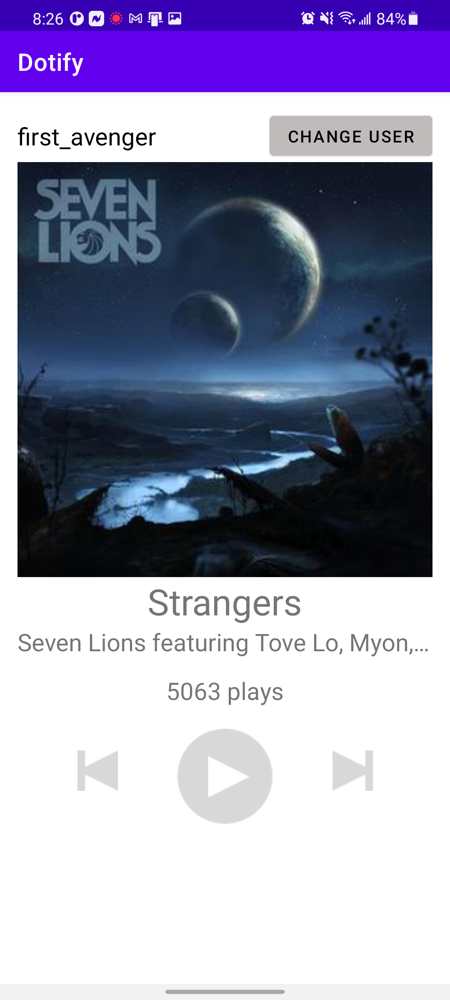

# HW1 - Layouts & Events by Eugene Lim

This is a spotify clone that has base UI functionality like increasing play count and showing toast messages for next/prev buttons.
User can change username by clicking the "CHANGE USER" button and apply the change clicking "APPLY" button.

## Extra credit: Attempted
3. If using ConstraintLayout, utilize a Barrier or Guideline somewhere with a view constrained to it (+0.25)
4. All hardcoded dimensions & colors are extracted into res/values/dimens.xml & res/values/colors.xml
respectively (+ .5)

## Screenshots

