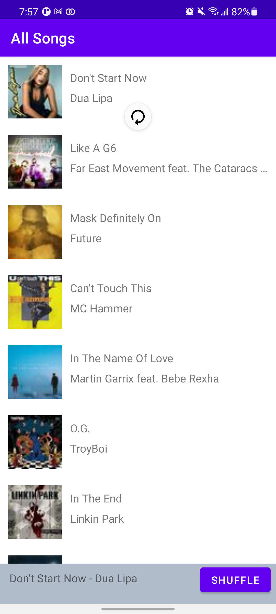
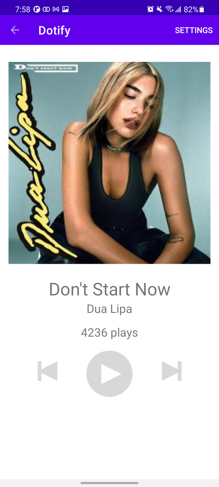

# HW4 - Application, JSON parsing & Network Requests 
## By Eugene Lim

This is a spotify clone that loads a list of songs from a HTTP request. Swipe down to load the list of songs again from HTTP request. When a song is clicked, a miniplayer appears at the bottom where a button will shuffle the songs and if the miniplayer is clicked then it will open that song to a player. (song selected is handled through application)

This player will show the song's name, artist and cover image. On the top right of player there will be a settings button. Click to see profile, statistics and about.

Changing orientation of the phone at the player will keep the play count. Changing orientation of the phone at the songs list will keep the mini player visible.

## Extra credit: Attempted
1. Add pull down to refresh function to your activity to trigger an HTTP fetch (+.25)

## Screenshots

