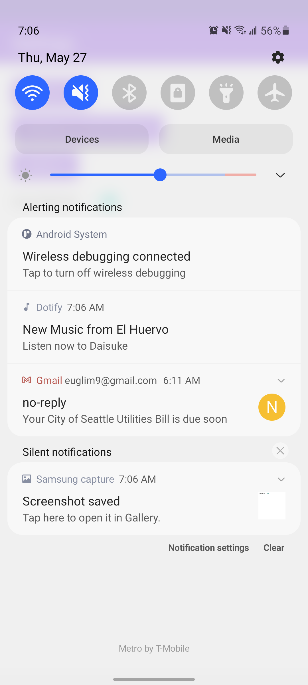
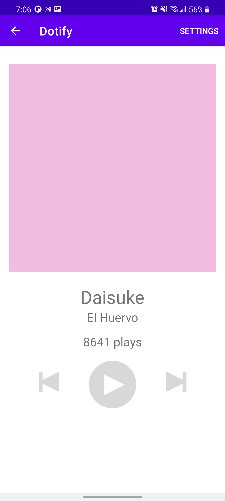

# HW5 - Background Tasks & Notifications
## By Eugene Lim

This is a spotify clone that loads a list of songs from a HTTP request. Swipe down to load the list of songs again from HTTP request. When a song is clicked, a miniplayer appears at the bottom where a button will shuffle the songs and if the miniplayer is clicked then it will open that song to a player. (song selected is handled through application)

This player will show the song's name, artist and cover image. On the top right of player there will be a settings button. Click to see profile, statistics and about.

Changing orientation of the phone at the player will keep the play count. Changing orientation of the phone at the songs list will keep the mini player visible.

At the settings, you can toggle to receive notifications of a random song.

## Extra credit: Attempted
1. FOR DOTIFY project ONLY: In requirement 2.b.v.2, tapping the notification should launch PlayerActivity
that passes the song data to the activity to show the song in the player (+1)
2. In a separate function, create another separate alternative work request that runs every 2 days when
the device’s battery is not too low and is connected to a network. For credit, you just need the request
code in your WorkManager class, no other code is required. (+.25)

## Screenshots

