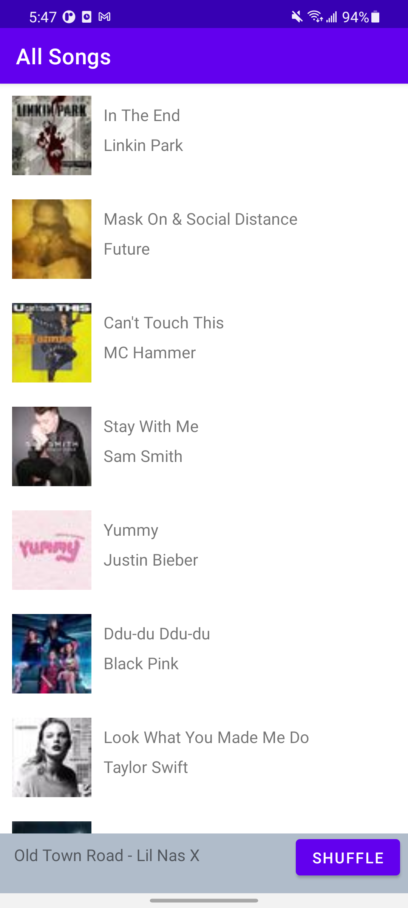
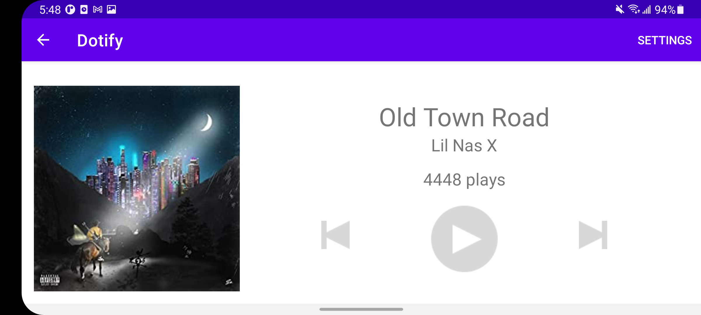
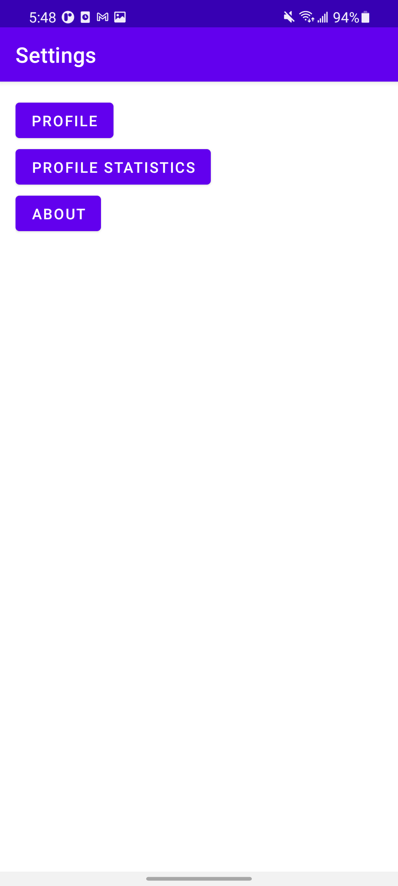

# HW3 - Fragments, Activity Lifecycle & Rotation by Eugene Lim

This is a spotify clone that loads a list of songs. When a song is clicked, a miniplayer appears at the bottom where a button will shuffle the songs and if the miniplayer is clicked then it will open that song to a player. 
 
This player will show the song's name, artist and cover image. On the top right of player there will be a settings button. Click to see profile, statistics and about. 
 
Changing orientation of the phone at the player will keep the play count. Changing orientation of the phone at the songs list will keep the mini player visible.

## Extra credit: Attempted
1. Every Fragment (other than SettingsFragment) has a Up/back button in the top right corner. Clicking
will take you back to the previous fragment (+.25)
2. Instead of Settings <Button> in your layout from requirement #1, make a Settings "Action Button” in
the app bar (header bar at the top). https://developer.android.com/training/appbar/actions (+.25)

## Screenshots

