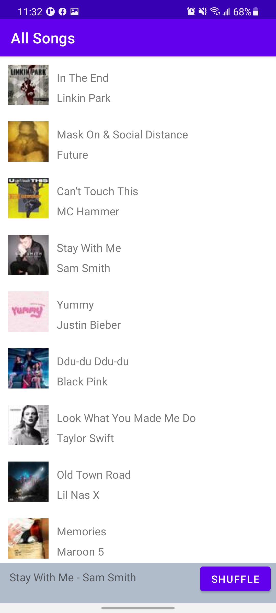
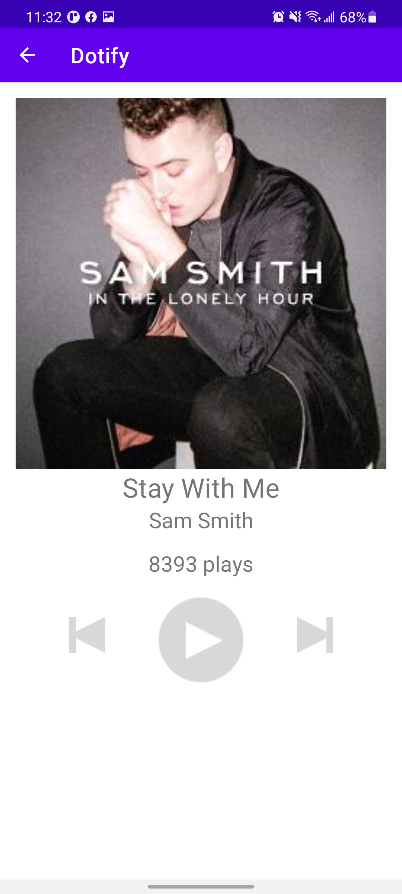

# HW2-REDO - Activities & RecyclerView by Eugene Lim

This is a spotify clone that loads a list of songs. When a song is clicked, a miniplayer appears at the bottom
where a button will shuffle the songs and if the miniplayer is clicked then it will open that song to a player.
This player will show the song's name, artist and cover image.

## Extra credit: Attempted
(1.) Show a stock Android back arrow button, ←, in the Header/Toolbar of Activity B. When clicked, it
should navigate back to SongListActivity (+.25)

(3.) When a user presses shuffle, the list should animate the changes using DiffUtil (+1)

## Screenshots

